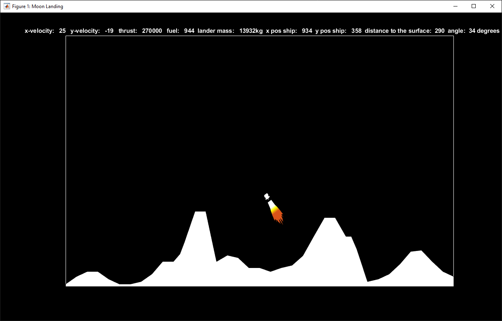

# lunar-lander
Lunar Lander project written in MATLAB for MECE117: Intro to Programming for Engineers

## Objectives
- Make as many landings as possible with the fuel provided
- Land with a velocity less than ten and angle parallel to the surface
## Controls
- w : increase thrust
- s : decrease thrust
- spacebar : full throttle
- left shift : engines off
- a : rotate left
- d : rotate right
- q : quit game (known bug: don't press q while zoomed in or the game will break the next time it runs)

### Note
This project was created at a time when I had zero exposure to programming best practices. Hence the monolithic file and the abundance of global variables.
